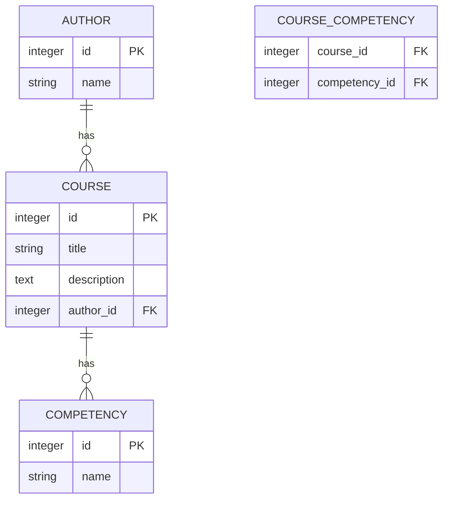

# README

## Требования

### _Бизнес требования_
Требуется создать прототип приложения онлайн-курсов.

Заказчику требуется система с реализованными сущностями:
- Курс
- Автор курса
- Компетенции, которые развивает данный курс

API должно реализовывать CRUD-операции.
### _Технические требования_
- Для прототипа можно не делать авторизацию
- API request должно быть покрыто тестами с помощью rswag, и содержать сгенерированную этой библиотекой Swagger документацию к API приложения.
- Версия Ruby on Rails не ниже 6.0
- PostgreSQL
### _Definition of done_
- Можно получить доступ к Swagger API документации и отправить тестовые запросы
- Тесты проходят без ошибок и покрывают API
- Начальные данные можно установить командой bin/rails db:seed

### Шаг 0
```
rails new financial-education --api -d postgresql
```

### Шаг 1
Для проектирования не слишком много требований. Поэтом будем использовать стандартные связи и типы, что бы не усложнять процесс.

Определяем связи в БД с минимальным набором сущностей


