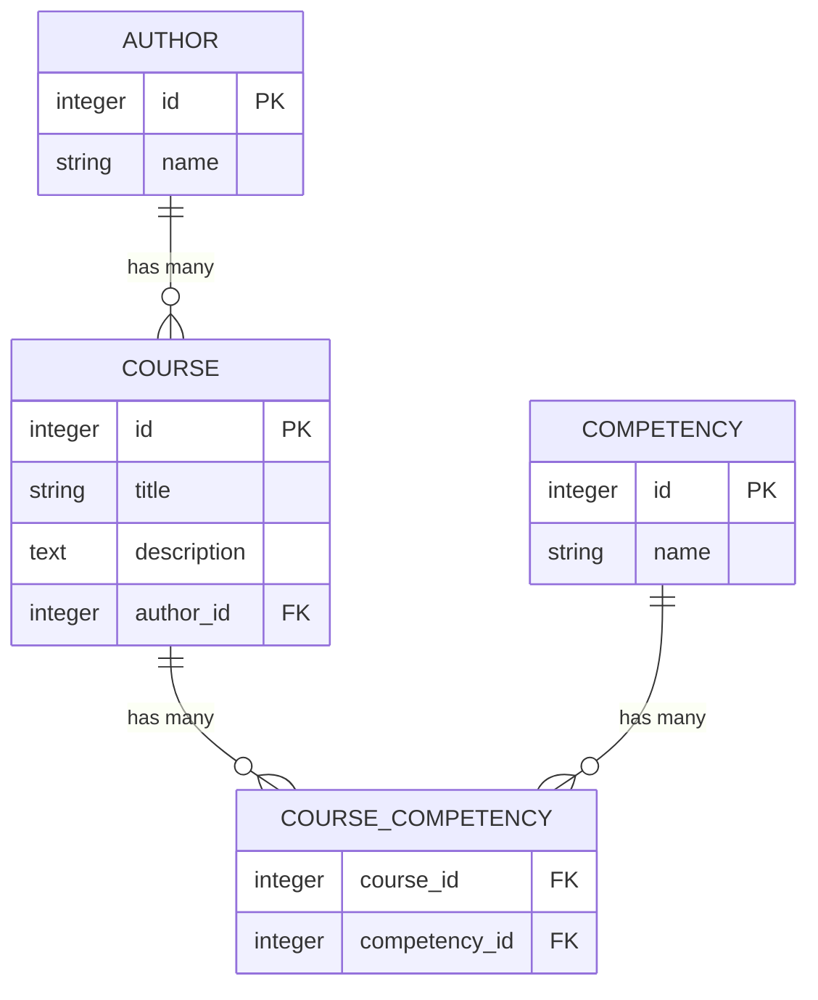

## Требования

### _Бизнес требования_
Требуется создать прототип приложения онлайн-курсов.

Заказчику требуется система с реализованными сущностями:
- Курс
- Автор курса
- Компетенции, которые развивает данный курс

API должно реализовывать CRUD-операции.
### _Технические требования_
- Для прототипа можно не делать авторизацию
- API request должно быть покрыто тестами с помощью rswag, и содержать сгенерированную этой библиотекой Swagger документацию к API приложения.
- Версия Ruby on Rails не ниже 6.0
- PostgreSQL
### _Definition of done_
- Можно получить доступ к Swagger API документации и отправить тестовые запросы
- Тесты проходят без ошибок и покрывают API
- Начальные данные можно установить командой bin/rails db:seed

### Шаг 0
```
rails new financial-education --api -d postgresql
```

### Шаг 1
Для проектирования не слишком много требований. Поэтом будем использовать стандартные связи и типы, что бы не усложнять процесс (bigint/enum и т.д опускаем)

Определяем связи в БД с минимальным набором сущностей



### Шаг 2
- Делаем в докере что бы проще было
- Инициализируем БД
- Создаем миграции
- Создаем базовую связь на уровне моделей
	- Учитывая базовые CRUD операции стоит предусмотреть в таком случае момент с удалением что бы случайно при удалении автора не потереть курс и всех к нему причастных. Поэтому просто сделаем `nullify` на всякий случай
- Делаем базовый `seed.rb` пока с использованием Faker что бы не усложнять себе жизнь

### Шаг 3
- Генерируем CRUD под  Авторов, Курсы, Компетенции
- Решил использовать blueprint что бы отделить сериализацию json
- Делаем базовую настройки гемов
- Доступ к документации будет по адресу `http://localhost:3000/api-docs/index.html`

### Шаг 4
- Описываем остаточные эндпоинты
- Для дестроя автора назначаем рандомного автора у кого совпали компетенции
- Добавил сервис для удаления автора с переасайном


### Запуск проекта
```bash
git clone git@github.com:romankirpichnikov/financial-education.git

cd financial-education

bundle install

docker compose up -d

rails db:create

rails db:seed

rails server

go to http://localhost:3000/api-docs/index.html
```
